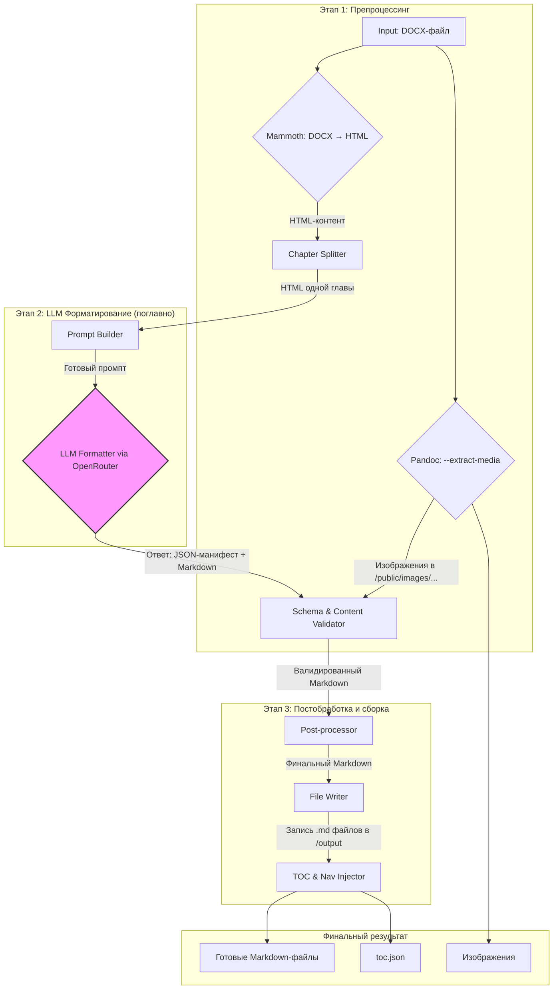

---

### **План разработки проекта: Конвертер документации DOCX → Markdown**

#### 1. Общее видение и ключевые принципы

**Цель:** Создать надежный и гибкий пайплайн для автоматической конвертации технических документов из формата DOCX в набор Markdown-файлов, соответствующих строгому внутреннему стандарту (house style).

**Ключевые принципы архитектуры:**

1.  **Модульность:** Каждый компонент системы решает одну конкретную задачу (например, конвертация в HTML, разделение на главы, форматирование LLM, валидация). Это упрощает разработку, тестирование и дальнейшую поддержку.
2.  **Гибридный подход:** Мы не полагаемся полностью на LLM. Система использует лучшие в своем классе инструменты для предварительной обработки (Mammoth, Pandoc), а LLM применяется точечно для форматирования текста, где требуется "человеческое" понимание контекста.
3.  **Детерминизм и отказоустойчивость:** Пайплайн должен быть предсказуемым. Постобработка и валидация гарантируют, что даже если LLM допустит небольшую ошибку, конечный результат будет исправлен и приведен к единому стандарту. Система должна предусматривать fallback-механизмы для обработки сложных или некорректно оформленных документов.
4.  **Конфигурируемость:** Ключевые параметры (API-ключи, пути, модель LLM, правила форматирования) должны выноситься в конфигурационные файлы, а не быть зашиты в коде.

#### 2. Предлагаемая архитектура

Архитектура представляет собой последовательный конвейер (pipeline), где результат работы одного этапа передается на вход следующему.

**Описание компонентов:**

*   **Mammoth:** Конвертирует DOCX в семантически чистый HTML, используя `style-map` для корректной интерпретации кастомных стилей (`ROSA_*`, списки, код).
*   **Pandoc:** Используется исключительно для надежного извлечения изображений в указанную директорию.
*   **Chapter Splitter:** Разделяет единый HTML-документ на логические части (главы) по тегу `<h1>`.
*   **Prompt Builder:** Динамически формирует промпт для LLM для каждой главы, включая системные инструкции (из `formatting_rules.md`), few-shot примеры (из папки `samples/`) и HTML-содержимое главы.
*   **LLM Formatter:** Отправляет запрос к LLM (через OpenRouter), обрабатывает ответ, разделяя его на JSON-манифест и Markdown-текст. Реализует логику повторных запросов (retry) и обработки ошибок API.
*   **Schema & Content Validator:** Первый уровень проверки. Валидирует полученный JSON по схеме. Проверяет, что Markdown-блок не пустой.
*   **Post-processor:** Набор скриптов для "чистки" и финализации Markdown: нумерация заголовков, исправление путей к изображениям, проверка `::AppAnnotation` блоков.
*   **File Writer:** Записывает обработанный Markdown в файлы согласно манифесту.
*   **TOC & Nav Injector:** После того как все файлы глав созданы, этот модуль проходит по ним и встраивает в YAML frontmatter ссылки `readPrev` и `readNext` для навигации, а также генерирует `toc.json`.

#### 3. Технологический стек

*   **Язык:** Python 3.11+
*   **Управление зависимостями:** Poetry (`pyproject.toml`)
*   **CLI-интерфейс:** Typer, Rich
*   **Конвертация DOCX → HTML:** Mammoth
*   **Извлечение медиа:** subprocess для вызова Pandoc
*   **Парсинг HTML:** BeautifulSoup4
*   **HTTP-клиент (для LLM):** HTTPX (поддерживает async и надежен)
*   **Валидация JSON:** jsonschema
*   **Вспомогательные утилиты:** python-slugify (для генерации URL-friendly имен)

#### 4. План разработки по этапам

План разбит на фазы, каждая из которых дает измеримый результат.

---

**Фаза 0: Основы проекта и настройка окружения (1-2 дня)**

*   **Задача 0.1:** Создать структуру проекта (папки `src`, `tests`, `scripts`, `output`).
*   **Задача 0.2:** Инициализировать проект с помощью Poetry (`pyproject.toml`), добавить основные зависимости (`typer`, `rich`).
*   **Задача 0.3:** Создать базовый CLI-интерфейс (`cli.py`) с одной командой `run`, которая пока просто выводит "Hello, World!".
*   **Задача 0.4:** Настроить базовое логирование.

**Результат:** Готовый к работе репозиторий с настроенным окружением.

---

**Фаза 1: Препроцессинг и извлечение контента (3-5 дней)**

*   **Задача 1.1: Модуль `preprocess.py` - конвертация в HTML.**
    *   Реализовать функцию `convert_docx_to_html(docx_path, style_map_path)`, использующую Mammoth.
    *   Создать и протестировать файл `mammoth_style_map.map` на основе предоставленного образца.
*   **Задача 1.2: Модуль `preprocess.py` - извлечение изображений.**
    *   Реализовать функцию `extract_images(docx_path, output_dir)`, которая вызывает `pandoc --extract-media`.
*   **Задача 1.3: Модуль `splitter.py` - разделение на главы.**
    *   Реализовать функцию `split_html_by_h1(html_content)`, которая принимает HTML и возвращает список HTML-фрагментов (каждый для одной главы).
*   **Задача 1.4: Интеграция в CLI.**
    *   Обновить команду `run` для выполнения шагов 1.1-1.3 и сохранения промежуточных результатов (HTML-частей) во временную папку.

**Результат:** Пайплайн, который успешно принимает DOCX и на выходе создает папку с изображениями и набор HTML-файлов, по одному на каждую главу.

---

**Фаза 2: Интеграция с LLM и форматирование (5-7 дней)**

*   **Задача 2.1: Модуль `schema.py`.**
    *   Определить и экспортировать `CHAPTER_MANIFEST_SCHEMA` как константу.
*   **Задача 2.2: Модуль `prompt_builder.py`.**
    *   Создать класс или функцию, которая загружает `formatting_rules.md`, несколько примеров из `samples/` и формирует полный системный и пользовательский промпт для одной главы.
*   **Задача 2.3: Модуль `llm_client.py`.**
    *   Реализовать класс `OpenRouterClient` для взаимодействия с API.
    *   Метод `format_chapter` должен принимать HTML главы, вызывать `PromptBuilder`, отправлять запрос, обрабатывать ответ (извлекать JSON и Markdown), валидировать JSON по схеме из `schema.py`.
    *   Реализовать логику обработки ошибок (429, 5xx) с экспоненциальной задержкой (exponential backoff).
*   **Задача 2.4: Интеграция в CLI.**
    *   Добавить в цикл обработки глав вызов `llm_client.format_chapter` и сохранение сырого Markdown в папку `output`.

**Результат:** Пайплайн генерирует Markdown-файлы для каждой главы. Форматирование может быть еще неидеальным, но основная логика работает.

---

**Фаза 3: Постобработка и валидация (4-6 дней)**

*   **Задача 3.1: Модуль `postprocess.py` - нормализация заголовков.**
    *   Написать функцию `normalize_headings(markdown_text, chapter_number)`, которая приводит заголовки к формату `X.Y`, `X.Y.Z`.
*   **Задача 3.2: Модуль `postprocess.py` - обновление путей к изображениям.**
    *   Написать функцию `rewrite_image_paths(markdown_text, doc_slug)`, которая заменяет пути к изображениям на целевой формат `/images/developer/administrator/<slug>/...`.
*   **Задача 3.3: Модуль `validators.py` - финальный линтер.**
    *   Создать набор функций для проверки конечного Markdown на соответствие правилам: наличие `::AppAnnotation`, корректный формат подписей к таблицам, пунктуация в списках компонентов.
*   **Задача 3.4: Модуль `navigation.py` - генерация навигации и TOC.**
    *   После генерации всех файлов, реализовать функцию, которая читает frontmatter всех `.md` файлов в `output`, сортирует их и вписывает `readPrev`/`readNext`.
    *   Создать функцию для генерации `toc.json`.
*   **Задача 3.5: Интеграция в CLI.**
    *   Встроить вызовы модулей постобработки и валидации в основной пайплайн перед финальной записью файлов.

**Результат:** Сгенерированные Markdown-файлы полностью соответствуют целевому формату, включая нумерацию, ссылки и навигацию.

---

**Фаза 4: Финализация и UX (2-3 дня)**

*   **Задача 4.1:** Улучшение CLI: добавить опции для указания путей, выбора модели, режима "dry-run".
*   **Задача 4.2:** Конфигурация: вынести API-ключ, URL OpenRouter, названия моделей и другие параметры в файл `.env` или `config.yaml`.
*   **Задача 4.3:** Документация: написать подробный `README.md` с инструкциями по установке, настройке и запуску.
*   **Задача 4.4:** Тестирование: написать базовые unit-тесты для критических модулей (`splitter.py`, `postprocess.py`).

**Результат:** Готовый к использованию, документированный и настраиваемый инструмент.

#### 5. Оценка рисков и пути их минимизации

1.  **Риск:** Неконсистентные или отсутствующие стили в исходных DOCX-файлах.
    *   **Митигация:** Разработать "адаптивный" `style-map`, который включает не только `ROSA_*`, но и стандартные стили Word ("Заголовок 1", "Обычный"). Включить логирование для предупреждения о нераспознанных стилях.
2.  **Риск:** LLM "галлюцинирует" или возвращает некорректный формат.
    *   **Митигация:** Строгая валидация ответа (JSON-схема, проверка наличия двух блоков). Использование моделей, хорошо следующих инструкциям (например, Claude 3, GPT-4). Реализация логики `retry`. Ключевая митигация — мощный модуль постобработки, который исправляет мелкие ошибки.
3.  **Риск:** Высокая стоимость и низкая скорость обработки из-за API-запросов.
    *   **Митигация:** Реализовать кэширование ответов LLM на основе хэша входного HTML-фрагмента. Это позволит при повторных запусках не обращаться к API для неизмененных глав. Использовать более дешевые и быстрые модели для менее критичных задач или черновой обработки.
4.  **Риск:** Сложные элементы (вложенные таблицы, многоуровневые списки) плохо конвертируются.
    *   **Митигация:** Использовать Pandoc как fallback-механизм для конвертации отдельных сложных фрагментов HTML в GFM Markdown, если Mammoth и LLM не справляются.

Этот план обеспечивает поэтапную, контролируемую разработку и приведет к созданию качественного и надежного продукта.